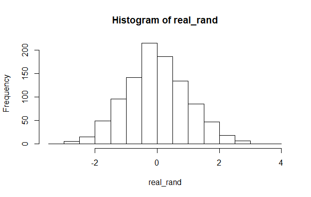

# Проверка случайности

## Внутренний рендом 0-37, 1000 значений

- [скрипт script.R](inner_random_37/script_solidity.R)

- [данные results](inner_random_37/results.txt)

### Shapiro-Wilk normality test > 0.05 Числа случайны

W = 0.99794, p-value = 0.2574

## Внешний рендом на "движениях" мышки)

- [скрипт script.R](inner_random_js/script_js.R)

- [скрипт init.js](inner_random_js/init.js)

- [данные results](inner_random_js/results.csv)

### Shapiro-Wilk normality test > 0.05 Числа случайны

W = 0.99938, p-value = 0.7512

## Внешний рендом на window.crypto.getRandomValues

- [скрипт script.R](inner_random_js_inner/script_js_inner.R)

- [скрипт init.js](inner_random_js_inner/init.js)

- [данные results](inner_random_js_inner/results.csv)

### Shapiro-Wilk normality test > 0.05 Числа случайны

W = 0.99844, p-value = 0.5155

## Внешний рендом на server side random

- [скрипт script.R](inner_random_php/script_php.R)

- [скрипт any_data.php](inner_random_php/any_data.php)

- [данные results](inner_random_js_inner/results.csv)

### Shapiro-Wilk normality test > 0.05 Числа случайны

W = 0.99801, p-value = 0.2852