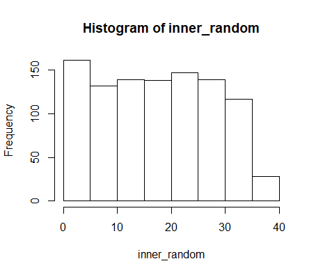

# Проверка случайности

- [скрипт script.R](script.R)

- [данные для генератора от 0 до 37 - results.txt](results.txt)

## Shapiro-Wilk normality test < 0.05 !!!

W = 0.95767, p-value < 2.2e-16

Числа не случайны(